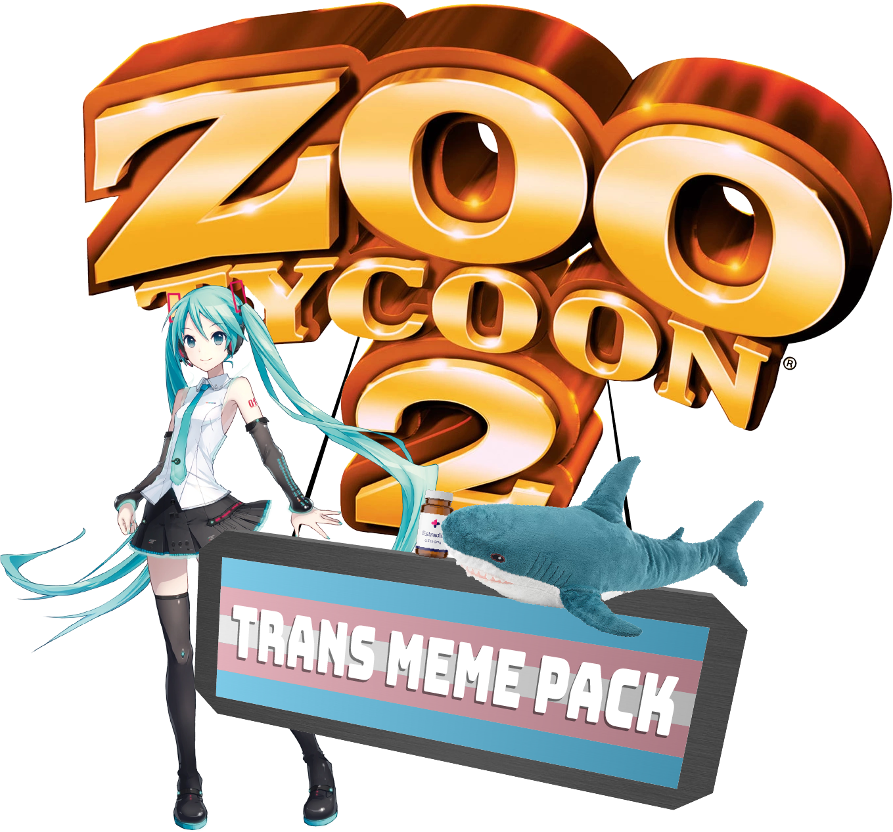

# Transgender Meme Pack

Trans rights are human rights!

This mod adds Trans pride paths, a flag, a HRT.CAFE sign and estrogen and testosterone to the game. Includes Mjmannella's same-sex mating mod.

# Additional dependencies
If you want the estrogen and testosterone to work, you need Arluq version 2.7 or higher. Additionally, If you want Guests to buy BLÅHAJ plushies, you need Buffzoo's Blahaj animal.

- [Arluq releases](https://github.com/ZtModArchive/ArluqTools/releases)
- [Buffzoo's Blahaj](https://www.nexusmods.com/zootycoon2/mods/209)

## Credits
- Apodemus
- [Mjmannella](https://github.com/Mjmannella) - same-sex mating mod
- [Smannsaker](https://smannsaker.wixsite.com/smannsaker) - Sign model and wooden pole texture
- [ReptileInk (Feral Designs)](https://getsauced2012.wixsite.com/zootycoonwarehouse) - Flag model and pole texture
- [IsabelleDotJpeg](https://twitter.com/IsabelleDotJpeg) - BLÅHAJ model and texture
- [Mirte](https://twitter.com/Mirteaaa) - HRT.CAFE writing
- IKEA of Sweden - BLÅHAJ zoopedia entry
- Wikipedia - Estrogen and testosterone zoopedia entry
- Nederlandse Spoorwegen - Gladde vloer sign design
